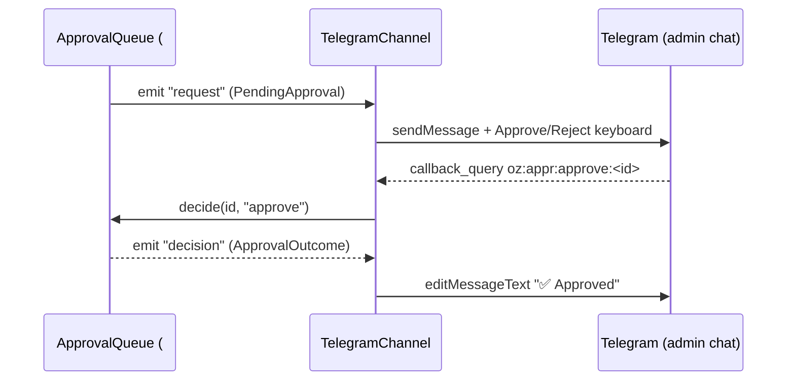

# Architecture

> Living document. Updated by the Code Issue agent as foundation epics land.

## Table of contents

1. Overview
2. Tech stack
3. Process topology
4. Module map (`src/`)
5. UI map (`ui/`)
6. Data model (SQLite)
7. Copilot SDK runtime + smart router + privacy mode
12. Approval queue + handoff primitives (#128)
    - 12.1 Telegram remote-control channel (#47)
    - 12.2 Platform service layer (#127)
    - 12.3 Cohort A connectors — Instagram / Facebook Pages / Threads (#53)
    - 12.4 Cohort B connectors — LinkedIn / Pinterest / TikTok (#60)
    - 12.5 Cohort C connector — X / Twitter v2 (#66)
    - 12.6 Outbox + content calendar + scheduler (#84)
    - 12.7 Brand voice + AI auto-reply pipeline (#78)
    - 12.8 Light CRM — contacts, lead scoring, history, merging (#90)
    - 12.9 Analytics dashboard + weekly digest (#95)
    - 12.10 Onboarding polish — model, OAuth, Meta app, recipes, tour (#100)
    - 12.11 GDPR right-to-delete (#138)
    - 12.12 YouTube Data API v3 quota tracker (#58)
13. Security model
14. Observability (Winston + audit log)

(See § 12.1 Telegram remote-control channel and § 12.2 Platform service layer.)

## 1. Overview

openzigs-social is a **local-first, single-tenant** social media manager. "Local-first" means that every piece of user data — credentials, conversation history, AI drafts, analytics — lives on the operator's machine and is never sent to a remote service unless the operator explicitly configures a cloud AI provider. The default LLM is Gemma 4 running locally via Ollama; cloud providers are opt-in BYOK and can be disabled entirely with a single privacy-mode flag.

**Process topology.** In v1 the entire backend runs as a single **Node 22 process**: an Express 5 API server, a Socket.IO realtime layer, a SQLite database (WAL mode via better-sqlite3), a Telegram bot (grammy), the outbox scheduler, the analytics cron, and the OAuth/webhook infrastructure — all composed in `src/server/index.ts` by `startServer()`. The Next.js 16.2 UI (`ui/`) runs as a separate process on port 3001 and communicates with the server exclusively over REST + Socket.IO. There is no shared in-process memory between the two: they are truly independent processes joined by the network boundary. This separation makes the UI replaceable and keeps the test surface for the server clean.

**AI routing.** All LLM traffic flows through `CopilotWrapper` (`src/copilot/wrapper.ts`), which composes a smart router, a privacy controller, and a session manager. The smart router estimates prompt token count (`Math.ceil(chars / 4)`) and routes to the local Ollama provider when the estimate is ≤ the `cloudThresholdTokens` (default 4,096) or when the privacy controller forces local-only. The privacy controller has three modes: `off` (cloud allowed), `session` (current-process local-only), and `global` (persistent kill-switch that prevents cloud provider construction entirely). This layered design means you can run fully air-gapped with zero code changes — just set `OPENZIGS_SOCIAL_PRIVACY_MODE=global`.

**Remote control via Telegram.** The only push-notification surface is a Telegram bot (`src/channels/telegram/`). It is opt-in, deny-by-default, and operates as a rendering layer on top of the shared `ApprovalQueue` primitive. Every action that needs human sign-off — an AI auto-reply draft, an outbox post, a DM relay — flows through the same approval queue regardless of whether the decision arrives via the Telegram bot, the web UI, or the API. This means Telegram is not a special code path; it is just one subscriber to a shared event bus.

## 2. Tech stack

| Layer | Technology | Version |
|---|---|---|
| Runtime | Node | 22 |
| Package manager | pnpm | 10 |
| Server framework | Express | 5 |
| Realtime | Socket.IO | 4.8 |
| Database | better-sqlite3 (WAL) | 12 |
| Logging | Winston | 3 |
| Hardening | helmet | 7 |
| Agent runtime | @github/copilot-sdk | ^0.3.0 |
| Default local LLM | Ollama / Gemma 4 | — |
| Telegram channel | grammy + @grammyjs/menu | 1.40 |
| UI framework | Next.js (App Router) | 16.2 |
| UI library | React | 19 |
| Styling | Tailwind CSS | 4.3 |
| UI primitives | Radix UI / shadcn | latest |
| Data fetching | TanStack Query | 5 |
| Schema validation | zod | 3.25 |
| Test runner | vitest | 2.1 |
| Desktop shell | Tauri | latest |

## 3. Process topology

v1 ships as a **single Node process** launched as a Tauri-managed sidecar.
The full rationale, alternatives (N-API in-process, separate daemon), and
consequences live in [docs/adr/0001-process-topology.md](adr/0001-process-topology.md).

All on-disk state lives under one data directory resolved by
`resolveDataDir()` (`src/config/paths.ts`):

* Default: `~/.openzigs-social/`
* Override: the `OPENZIGS_SOCIAL_HOME` environment variable (used by the
  sandboxed macOS bundle, which points at
  `$HOME/Library/Application Support/social.openzigs.app/`, and by tests,
  which point at a `os.tmpdir()` scratch directory).

Layout under the data directory:

| Path | Contents |
|---|---|
| `openzigs-social.db` | SQLite database (WAL) |
| `auth.json` | Encrypted credential vault (`0o600`) |
| `user.json` | User config overlay |
| `logs/` | Rotating Winston log files |
| `audit/audit.jsonl` | Append-only audit log |
| `sessions/` | Per-session transcript JSONL + `.meta.json` sidecars |

## 4. Module map (`src/`)

| Module | Responsibility |
|---|---|
| `config/paths.ts` | Data-directory + file-path resolution (`OPENZIGS_SOCIAL_HOME` aware) |
| `config/schema.ts` + `config/index.ts` | Zod schema + `default.json` → `user.json` → env layering |
| `logging/logger.ts` | Winston JSON logger (stdout + optional rotating file) |
| `logging/redact.ts` | Recursive secret redaction for log payloads |
| `logging/audit-logger.ts` | Append-only JSONL audit log |
| `db/migrator.ts` | Versioned SQL migrations runner (`schema_migrations` ledger) |
| `db/index.ts` | better-sqlite3 bootstrap (WAL, pragmas, migrate-on-open) |
| `sessions/transcript-manager.ts` | JSONL transcript ledger + metadata sidecars |
| `server/app.ts` | Express 5 app, helmet, health/ready/metrics routes |
| `server/socket.ts` | CORS-locked Socket.IO server, client-id session restoration |
| `server/metrics.ts` | Per-platform sent/received/failed counters |
| `server/index.ts` | Composition root: wires config/logger/db/sessions/server |
| `copilot/` | Copilot SDK wrapper, providers, smart router, privacy (epic #28) |
| `vault/` | Encrypted credential vault + OAuth refresh scheduler (epic #28) |
| `approvals/approval-queue.ts` | `ApprovalQueue` — awaitable-Promise + EventEmitter approval primitive (epic #128) |
| `handoff/handoff-manager.ts` | `HandoffManager` — per-thread AI↔human ownership + draft cancellation (epic #128) |
| `channels/telegram/` | Telegram remote-control channel: grammy bot, inline approval keyboards, `/queue` menu, DM relay, admin ACL (epic #47) |
| `channels/social/dm-sender.ts` | `SocialDmSender` port — outbound DM contract implemented by the platform service (#127) |
| `platform/oauth/` | OAuth handshake: CSRF state store, connector registry, callback router (#139) |
| `platform/webhooks/` | Inbound webhooks: HMAC verify, dedupe ledger, handler registry, router (#140) |
| `platform/rate-limit/` | Token bucket + per-platform broker with quotas/warnings (#141) |
| `platform/retry/` | Exponential backoff, retry, dead-letter queue (#142) |
| `platform/social-brain/` | Idempotent inbound persistence (contacts/threads/messages) (#143) |
| `platform/dm/` | `SocialDmSenderRegistry` (the #51 port) + rule-chain `DmDispatcher` (#144) |
| `connectors/meta/` | Cohort A connectors: Instagram + Facebook Pages + Threads via Meta Graph API `v25.0`, built on the #127 ports (epic #53) |
| `connectors/{linkedin,pinterest,tiktok}/` | Cohort B connectors: LinkedIn (no DM) + Pinterest + TikTok (PRIVATE-only), built on the #127 ports (epic #60) |
| `connectors/youtube/quota.ts` | YouTube Data API v3 daily quota tracker: `recordQuotaUsage()`, `getQuotaUsage()`, `YOUTUBE_DAILY_QUOTA` / `READ_COST` / `WRITE_COST` constants, persisted in `youtube_quota_usage` (migration `0011`) (epic #58) |
| `server/youtube/router.ts` | `GET /api/youtube/quota` — today's quota usage: `{day_utc, used, limit:10000, pct}` (epic #58) |
| `connectors/twitter/` | Cohort C connector: X (Twitter) v2 with per-tier write-quota tracking + DM gated to paid tiers, built on the #127 ports (epic #66) |
| `inbox/rules/` | Declarative comment **rule engine** — no-`eval` condition AST evaluator, repository, and append-only firing audit trail (epic #71, #74) |
| `inbox/repository.ts` + `inbox/platform-limits.ts` | Unified thread/message read model (priority+recency sort, unread counts, FTS5 search) and per-platform reply limits (LinkedIn comments-only) (epic #71, #76/#77) |
| `server/inbox/router.ts` | `/api/inbox/*` — threads, thread detail, mark-read, reply (via the #144 DM dispatcher), rules CRUD, firings, platform-limits; consumes the #143 SocialBrain store (epic #71) |
| `server/connections/router.ts` | `GET /api/connections` — per-platform connect/needs-reconsent status (never echoes tokens) (#53) |
| `personality/profiler.ts` + `personality/rulebook-repository.ts` | **Linguistic Profiler** — `scoreVoice()` token-overlap voice scorer (tone weighted 2:1 over exemplars, banned-word **veto** clamps to 0) + the single-row brand-voice rulebook store (epic #78, #79/#80) |
| `routing/decision.ts` + `routing/pipeline.ts` + `routing/audit-repository.ts` | Confidence/voice **threshold gate** (inclusive `>=`), the evaluate→auto-send/queue→resolve pipeline, and the append-only `auto_reply_audit` store (epic #78, #81/#82) |
| `server/auto-reply/router.ts` | `/api/auto-reply/*` — config, rulebook GET/PUT, draft `score`, `evaluate`, audit `resolve`, and the queryable audit log (epic #78, #83) |
| `analytics/` | Analytics roll-up engine + cache: `aggregator` (MAX-per-object windowed roll-ups), `heatmap` (timezone-aware 7×24 buckets), `top-posts`, `digest` (Markdown), `mailer` (nodemailer, SMTP password from env), `repository` (idempotent day-keyed cache, clamped `LIMIT`s), and `scheduler` (two `node-cron` wrappers, `analytics:updated` emit) (epic #95) |
| `server/analytics/router.ts` | `/api/analytics/*` — `summary`, `engagement`, `heatmap`, `top-posts`; window/platform validated (422 on malformed), 60-req/min/IP limiter (epic #95) |
| `crm/lead-score.ts` + `crm/email.ts` | **Light CRM** primitives — deterministic `scoreLead()` (engagement/sentiment/follower, no ML) + pure email/follower discovery helpers (epic #90, #92) |
| `crm/repository.ts` | `CrmRepository` — cross-platform identity sync over SocialBrain, scored list/detail, unified timeline, suggested + transactional manual merge (epic #90, #91/#93/#94) |
| `crm/gdpr.ts` | `deleteContact()` — single-transaction GDPR right-to-delete: purges `crm_contacts`, `social_messages`, `auto_reply_audit`, `platform_insights_raw`, and optionally `crm_contact_merges` in one atomic SQLite transaction; returns a `GdprDeleteReceipt` with per-table row counts (#138) |
| `server/crm/router.ts` | `/api/contacts/*` — scored list, detail+timeline, suggested-merges, merge history, `POST /merge`, and `DELETE /:id` GDPR delete (emits `crm:merge`) (epic #90, #138) |

## 5. UI map (`ui/`)

The desktop UI is a **Next.js 16.2** App Router app (`ui/`) styled with
Tailwind v4 (CSS-first `@theme`) and built from Radix UI / shadcn primitives.
It runs on port `3001` in development and talks to the Node server (port
`3000`) over REST + Socket.IO.

| Path | Responsibility |
|---|---|
| `app/layout.tsx` | Root layout; injects the no-FOUC theme script and wraps the tree in `Providers` + `TopNav` |
| `app/providers.tsx` | Client providers: TanStack Query, `ThemeProvider`, the Socket.IO client, and the toast `Toaster`; exposes `useSocket()` |
| `app/page.tsx` | Dashboard shell — KPI card grid + quick-actions dialog |
| `app/{compose,calendar,analytics,contacts,settings}/page.tsx` | Route placeholders for the primary nav destinations |
| `app/inbox/page.tsx` + `components/inbox/` | Unified inbox: filter bar + full-text search, live thread list (badges/unread/priority), thread detail with DM/Comments tabs + reply composer; LinkedIn DM section hidden (epic #71, #76/#77) |
| `lib/inbox.ts` | Inbox client: thread/reply fetchers, per-platform limits mirror, and React Query hooks subscribed to `inbox:*` socket events (epic #71) |
| `app/compose/page.tsx` | Composer: per-account publish-target picker + post body (epic #53) |
| `components/compose/publish-targets.tsx` | Publish-target checkbox list driven by `GET /api/connections` (#53) |
| `lib/connections.ts` | `fetchConnections()` client for `GET /api/connections` (#53) |
| `app/settings/page.tsx` + `components/auto-reply/` | Brand-voice rulebook editor (tone/banned-words/exemplars), hybrid-posture summary, and the decision log where queued drafts are reviewed/approved/edited/rejected with both scores surfaced (epic #78, #83) |
| `lib/auto-reply.ts` | Auto-reply client: config/rulebook/score/audit fetchers + React Query hooks subscribed to `autoReply:*` socket events (epic #78) |
| `app/analytics/page.tsx` + `components/analytics/` | Analytics dashboard: window (7/30/90) + platform filter, KPI row, recharts engagement chart (pivoted client-side), posting-time heatmap, top-posts leaderboard; live on `analytics:updated` (epic #95) |
| `lib/analytics.ts` | Analytics client: summary/engagement/heatmap/top-posts fetchers, `pivotEngagement`/`formatCompact`/`dayLabel` transforms, and React Query hooks subscribed to `analytics:updated` (epic #95) |
| `app/contacts/page.tsx` + `components/crm/` | Light CRM: scored contact list (lead-bucket badge), contact detail with unified conversation timeline + linked accounts, and a suggested-merge queue with one-click merge (epic #90, #93/#94) |
| `lib/crm.ts` | CRM client: contact/detail/suggested-merge fetchers + React Query hooks subscribed to the `crm:merge` socket event (epic #90) |
| `components/top-nav.tsx` | Primary top navigation (active-route `aria-current`) + theme toggle |
| `components/theme-provider.tsx` | Theme context backed by `useSyncExternalStore`; `localStorage` persistence + system-scheme tracking |
| `components/theme-toggle.tsx` | System/light/dark dropdown toggle |
| `components/kpi-card.tsx` / `components/dashboard-dialog.tsx` | Dashboard building blocks |
| `components/ui/` | shadcn primitives (button, card, dialog, dropdown-menu, input, label, tabs, toast) |
| `lib/theme.ts` | Theme resolution + DOM application via `document.startViewTransition` (React 19.2 View Transitions) |
| `lib/socket.ts` | `createSocket()` — Socket.IO client sending the persisted `clientId` in the handshake auth; persists the server-assigned session id on `session:restored` |
| `lib/client-id.ts` | Stable client id generation/persistence (`localStorage`, UUID v4) |
| `lib/query-client.ts` | TanStack Query client factory |
| `lib/nav.ts` | Declarative nav route table + active-route helper |

The client-id contract mirrors the server: on connect the socket sends
`auth.clientId` (restored from `localStorage`), and the server replies with
`session:restored` carrying the canonical `sessionId`, which the client
persists back to `localStorage` so sessions survive reloads.

## 6. Data model (SQLite)

The database lives at `<dataDir>/openzigs-social.db` and is opened in WAL
mode with `foreign_keys=ON` and a 5 s `busy_timeout` (`src/db/index.ts`).
Schema changes are applied **only** through the migrations runner
(`src/db/migrator.ts`): every `migrations/NNNN-name.sql` file runs once,
inside its own transaction, and is recorded in the `schema_migrations`
ledger (`version INTEGER PRIMARY KEY`, `applied_at`). Migration files are
immutable once shipped. The `0001-init.sql` baseline creates a `meta`
key/value table; feature tables are added by later epics.

`0002-platform-service.sql` (epic #127) adds the persistence the connector
epics, the inbox, the auto-reply pipeline, the outbox, and the DM dispatcher
share:

| Table | Purpose |
|---|---|
| `social_contacts` | Inbound contacts, idempotent on `UNIQUE (platform, platform_contact_id)` |
| `social_threads` | Conversation threads, `UNIQUE (platform, platform_thread_id)`, FK → `social_contacts` |
| `social_messages` | Inbound/outbound messages, `UNIQUE (platform, platform_message_id)`, FK → thread + contact |
| `webhook_events` | Dedupe ledger, `UNIQUE (platform, event_id)` so replays are no-ops |
| `outbox_dlq` | Dead-letter queue for terminally-failed outbound ops (#142) |

`0003-meta-insights.sql` (epic #53) adds `platform_insights_raw` — raw
per-object metric snapshots (`UNIQUE (platform, object_id, metric, captured_for)`)
written by the Facebook/Threads insights pollers via `InsightsRepository`.

`0005-inbox-rule-engine.sql` (epic #71) adds the inbox read/rule tables on top
of the #127 SocialBrain store:

| Table | Purpose |
|---|---|
| `inbox_rules` | Declarative rule definitions (condition AST + actions JSON, enabled flag) |
| `inbox_rule_firings` | **Append-only** audit trail of every rule that fired against a message (FK → `inbox_rules`, **ON DELETE SET NULL** — firings are retained when a rule is deleted; migration `0006`) |
| `inbox_thread_state` | Per-thread derived state — priority, flagged, `last_read_at` (PK/FK → `social_threads`, CASCADE) |
| `social_messages_fts` | SQLite **FTS5** external-content index over `social_messages.body`, kept in sync by insert/update/delete triggers, powering inbox full-text search |

`0008-auto-reply-audit.sql` (epic #78) adds the brand-voice + auto-reply tables:

| Table | Purpose |
|---|---|
| `brand_voice_rulebook` | Single-row (`CHECK (id = 1)`) workspace voice config — `tone`, `banned_words_json`, `exemplars_json` — read by the profiler and edited from `/settings` |
| `auto_reply_audit` | **Append-only** decision ledger — `thread_id`, `contact_id`, `platform`, `prompt`, `draft_text`, `final_text`, `confidence`, `voice_match`, `tone_match`, `banned_hits_json`, `decision` (`auto_send`/`queue`), `model`, `human_override`, `outcome` (`pending`/`sent`/`rejected`), timestamps. Indexed by `thread_id`, `created_at`, and `contact_id` (GDPR right-to-delete cascade, #138) |

`0009-crm.sql` (epic #90) adds the Light CRM identity layer over the #127
SocialBrain store:

| Table | Purpose |
|---|---|
| `crm_contacts` | Cross-platform CRM identity — `display_name`, normalized lowercase `email`, `follower_count`, timestamps; indexed by `email` |
| `crm_contact_links` | One identity ↔ many `social_contacts` join, `UNIQUE (social_contact_id)` (a social contact maps to exactly one identity), **ON DELETE CASCADE** |
| `crm_contact_merges` | **Append-only** merge audit — `survivor_id`, `source_id`, `mode` (`manual`/`suggested`), `created_at`; indexed by `survivor_id` |

`0011-youtube-quota.sql` (epic #58) adds the YouTube quota ledger:

| Table | Purpose |
|---|---|
| `youtube_quota_usage` | Daily YouTube Data API v3 quota totals — `day_utc` (`YYYY-MM-DD` UTC, UNIQUE), `quota_units`; upserts accumulate atomically with `ON CONFLICT DO UPDATE SET quota_units = quota_units + excluded.quota_units` |

`0012-youtube-quota-alert.sql` (epic #58 follow-up) adds:

| Column | Purpose |
|---|---|
| `youtube_quota_usage.alert_sent` | Per-day flag (0/1) ensuring the 80%-threshold Telegram alert fires exactly once per UTC day; added via `ALTER TABLE` |

`0010-analytics.sql` (epic #95) adds the pre-computed analytics cache the
dashboard reads from. Each table is keyed by `captured_for` (a `YYYY-MM-DD` day)
and `UNIQUE` on its dimensions, so a nightly re-run **replaces** that day's rows
rather than duplicating them:

| Table | Purpose |
|---|---|
| `analytics_rollup` | Windowed metric roll-ups, `UNIQUE (platform, window_days, metric, captured_for)` — engagement/posts/impressions/followers per 7/30/90-day window |
| `analytics_heatmap` | Posting-time buckets, `UNIQUE (platform, day_of_week, hour_of_day, captured_for)` |
| `analytics_top_posts` | Per-window leaderboard, `UNIQUE (platform, window_days, external_id, captured_for)` |

## 7. Copilot SDK runtime + smart router + privacy mode

All LLM traffic flows through `CopilotWrapper` (`src/copilot/wrapper.ts`),
which composes four collaborators:

1. **Providers** (`src/copilot/providers/`) — `Provider` interface with
   concrete implementations for Copilot (via `@github/copilot-sdk` v0.3),
   OpenAI, Anthropic, any OpenAI-compatible endpoint (Groq, Together,
   OpenRouter, etc.), and Ollama. The factory in `factory.ts` is the only
   place callers should construct providers.

2. **Smart router** (`smart-router.ts`) — estimates tokens with
   `Math.ceil(chars / 4)`, routes to the local provider when the estimate
   is ≤ `cloudThresholdTokens` (default `4096`) or whenever the privacy
   controller forces local. Falls through to local when no cloud provider
   is configured.

3. **Privacy controller** (`privacy.ts`) — three modes:
   * `off` — smart router free to use cloud
   * `session` — current process force-routes everything to local
   * `global` — persistent kill-switch; constructing a cloud provider is
     a hard error (defence in depth)

4. **Session manager** (`session-manager.ts`) — owns per-session message
   history and a running token counter. Emits `session.tokens.update`
   after every chunk so Socket.IO and persistence layers can stream.

### Ollama / Gemma 4 default

`createOllamaProvider()` defaults to Gemma 4. `pickGemma4Variant(totalmem)`
picks by host RAM (`e2b` < 8 GiB, `e4b` 8–16 GiB, `12b` ≥ 16 GiB).
`probeOllama()` hits `/api/tags` and `pickInstalledGemma4()` prefers the
largest installed variant (`12b` > `e4b` > `e2b`).

### Copilot SDK v0.2 → v0.3 migration (issue #130)

We pinned `@github/copilot-sdk` at `^0.3.0`. Breaking changes that touch
our wrapper surface:

| Area | 0.2 | 0.3 | Our action |
|---|---|---|---|
| `createSession` | `onPermissionRequest` optional | required | Pass `approveAll` from the SDK — our wrapper is a single-tenant runtime so blanket approval is correct. |
| MCP config types | `MCPLocalServerConfig` / `MCPRemoteServerConfig` | renamed to `MCPStdioServerConfig` / `MCPHTTPServerConfig` | Not referenced by our code. |
| Filesystem hook | `SessionFsHandler` | `SessionFsProvider` (+ `createSessionFsAdapter`) | Not referenced by our code. |
| New exports | — | `ProviderConfig`, `DefaultAgentConfig`, `convertMcpCallToolResult` | Noted; unused. |

Session, streaming, and tool-call surfaces (`CopilotSession.on(...)`,
`session.sendAndWait(...)`, `session.disconnect()`) are unchanged.

## 12. Approval queue + handoff primitives (#128)

Two small, in-memory, framework-agnostic primitives shared by every surface
that needs human-in-the-loop control. They have no UI of their own and no DB
layer — consuming surfaces (#47 Telegram, #71 inbox, #78 auto-reply, #84
outbox, the DM dispatcher) restore their own context and re-issue requests on
restart. Both expose `list()` for snapshotting.

### `ApprovalQueue` (`src/approvals/approval-queue.ts`, #49)

EventEmitter-based, awaitable primitive:

* `request(payload, { timeoutMs?, id? }): Promise<ApprovalOutcome>` — **always
  resolves, never rejects**. On timeout it resolves `{ decision: "timeout" }`
  so callers can fall back gracefully.
* `decide(id, "approve" | "reject", metadata?): boolean` — settles the awaiting
  Promise. Idempotent and race-safe: a decision after timeout or a second
  decision is a no-op (`false`), never a double-settle or throw.
* `list()` / `get(id)` / `has(id)` / `size` — inspect pending requests.
* `clear()` — settle all pending as timeouts (shutdown).
* Emits `request`, `decision`, `timeout`. Timers are cleared on settle and
  decided/timed-out entries removed from the pending map (no leaks). Inputs
  are Zod-validated at the boundary.

### `HandoffManager` (`src/handoff/handoff-manager.ts`, #75)

Per-thread AI↔human ownership with cancellation:

* `register(threadId, controller = new AbortController()): { controller,
  unregister }` — wire the `signal` into in-flight draft generation; this is
  the minimal cancellation interface the auto-reply pipeline (#78) plugs into.
* `takeOver(threadId, reason?)` — synchronously aborts every registered
  controller (well within the 2s budget) and marks the thread human-owned.
* `release(threadId, reason?)` — return ownership to AI.
* `isHumanOwned(threadId)` / `owner(threadId)` / `list()` — query state.
* Emits `ownership.change` (`{ threadId, owner, previous, reason?, at }`).
  Registering a draft on an already human-owned thread aborts it immediately.

## 12.1 Telegram remote-control channel (#47)

The Telegram bot (`src/channels/telegram/`) is openzigs-social's only push +
remote-control surface. It is **opt-in** (`telegram.enabled`, default `false`)
and reads its bot token + primary admin chat id from the encrypted vault. The
grammy `Bot` is **injected** into `TelegramChannel`, so tests intercept every
outgoing API call with a transformer — no network is required to verify the
channel.

`TelegramChannel.register()` wires the bot in a fixed, deny-by-default order:

1. **ACL middleware** (`acl.ts`, #52) — runs first; any update from a chat not
   on the admin allow-list is logged (chat id only) and silently dropped.
2. **`@grammyjs/menu` queue menu** — the interactive `/queue` listing (#48).
3. **Admin commands** (`commands.ts`, #52) — `/start`, `/status`, `/privacy`,
   `/queue`, `/dm`.
4. **Inline approval callbacks** (`approval-keyboard.ts`, #50) — `oz:appr:*`
   callback data, parsed defensively.
5. **Approval-queue bridge** — subscribes to the shared `ApprovalQueue`.

There is exactly one approval system (the #128 `ApprovalQueue`); Telegram is
only a rendering + routing layer on top of it.


```mermaid
sequenceDiagram
  participant Q as ApprovalQueue (#128)
  participant C as TelegramChannel
  participant T as Telegram (admin chat)
  Q->>C: emit "request" (PendingApproval)
  C->>T: sendMessage + Approve/Reject keyboard
  T-->>C: callback_query oz:appr:approve:<id>
  C->>Q: decide(id, "approve")
  Q-->>C: emit "decision" (ApprovalOutcome)
  C->>T: editMessageText "✅ Approved"
```

The **DM relay** (#51) parses `/dm <platform> <recipient> <message>` and
delivers through the `SocialDmSender` port (`channels/social/dm-sender.ts`).
No adapter is wired yet (the platform service #127 owns them), so the relay
reports "unavailable" rather than faking a send — there are no stub network
calls.

## 12.2 Platform service layer (#127)

`src/platform/` holds the cross-cutting, framework-agnostic primitives that
every social connector (Cohort A/B/C), the unified inbox, the auto-reply
pipeline, the outbox, and the DM dispatcher share. Every primitive takes an
injected clock / `sleep` / `emit`, so the whole layer is deterministic under
test — no real timers, no network.

| Sub-issue | Module | Responsibility |
| --- | --- | --- |
| #139 | `oauth/` | OAuth handshake: CSRF state store, connector registry, callback router |
| #140 | `webhooks/` | Inbound webhooks: HMAC verify, dedupe ledger, handler registry, router |
| #141 | `rate-limit/` | Token bucket + per-platform broker with quotas and warnings |
| #142 | `retry/` | Exponential backoff, retry, dead-letter queue |
| #143 | `social-brain/` | Idempotent inbound persistence (contacts/threads/messages) |
| #144 | `dm/` | DM sender registry (the #51 port) + rule-chain dispatcher |

### OAuth (`oauth/`, #139)

`OAuthStateStore` mints single-use, TTL-bounded `state` tokens
(`randomBytes(32)`, base64url) and verifies them in constant time
(`timingSafeEqual`); a consumed or expired state is rejected. `ConnectorRegistry`
maps a platform key to an `OAuthTokenExchanger` port. `createOAuthRouter`
exposes `GET /oauth/callback/:platform`:

* unknown platform → **404**
* missing / expired / replayed `state` → **400**
* exchanger failure → **502** (no secret in the response)
* success → persist `{ accessToken, refreshToken?, expiresAt }` via the vault,
  then redirect to a path-validated success URL (open-redirect guarded).

### Webhooks (`webhooks/`, #140)

HMAC signatures are verified in constant time (`hmac.ts`, sha1/256/512).
`WebhookEventStore.recordIfNew` dedupes deliveries with
`INSERT … ON CONFLICT DO NOTHING` against `webhook_events`. `createWebhookRouter`
mounts at `/webhooks/:platform` on the **raw** body (before `express.json`, so
the signature is computed over exact bytes): bad signature → **401** (no body
echo), duplicate event → **200**, handler throw → **500**.

### Rate limiting (`rate-limit/`, #141)

`TokenBucket` refills against an injected clock. `RateLimitBroker` holds a budget
per platform (`capacity`, `refillPerSec`, optional hard `quota`): `tryAcquire`
never blocks, `acquire` awaits the next refill via injected `sleep` (no tight
loop), and an edge-triggered `rate-limit:warning` event fires once when
utilization crosses 80% (re-arming after the bucket refills back below the
threshold).

### Retry + DLQ (`retry/`, #142)

`computeBackoffMs` is exponential with jitter. `retry` loops up to `maxAttempts`,
throwing `RetryExhaustedError` on the final attempt or immediately on a
non-transient error. `dispatchWithDlq` **never throws** — a terminal failure is
recorded in the `outbox_dlq` table via `DlqRepository` for later inspection.

### SocialBrain (`social-brain/`, #143)

`SocialBrainRepository` upserts contacts, threads, and messages idempotently,
keyed on platform-native ids (`UNIQUE (platform, platform_*_id)`), so a webhook
replay or backfill never duplicates rows.

### DM dispatch + sender registry (`dm/`, #144)

`SocialDmSenderRegistry` **implements the #51 `SocialDmSender` port** by
delegating `sendDm` to a per-platform adapter registered at runtime. This is the
seam that makes Telegram's `/dm` relay (#51) live: `startServer` builds one
shared registry and hands it to both the platform layer and the Telegram
channel, so once a connector registers an adapter the relay stops reporting
"unavailable". `DmDispatcher` runs an ordered rule chain over each inbound DM —
`humanOwnedGuard` (stops when the #128 `HandoffManager` marks the thread
human-owned) and `approvalGatedReply` (routes a draft through the #128
`ApprovalQueue` before sending).

## 12.3 Cohort A connectors — Instagram / Facebook Pages / Threads (#53)

`src/connectors/meta/` is the first concrete connector epic. It consumes the
#127 ports rather than reinventing them, so the connector code is small and
focused on the Meta Graph API (`v25.0`) surface. The whole module is opt-in
behind `platform.meta.enabled` (default `false`); when disabled there is zero
Meta network surface. Every credential — the Meta app id/secret and per-account
access tokens — is read from the encrypted vault (`getMeta()`), never config or
logs, and user-supplied Graph URLs pass through the SSRF guard.

| Sub-issue | Module | Responsibility |
| --- | --- | --- |
| #54 | `graph-client.ts` / `dispatcher.ts` | `MetaGraphClient` transport (SSRF-validated `v25.0` base URLs) + `MetaDispatcher` (broker slot per op, DLQ on failure) |
| #54/#57/#135 | `oauth.ts` | `FacebookOAuthExchanger` + `ThreadsOAuthExchanger` |
| #55/#56 | `instagram/` | publisher, DM sender, inbox poller |
| #57 | `facebook/pages.ts` | pages, posts, comments, insights |
| #135/#136/#137 | `threads/` | publisher, reply poller, insights poller |
| #59 | `webhook-handler.ts` | `x-hub-signature-256` verified handler for all three platforms |
| — | `scheduler.ts` / `index.ts` | poll scheduler + `registerMetaConnectors` wiring |

### How each #127 port is consumed

* **`OAuthTokenExchanger` (#139)** — `FacebookOAuthExchanger` (long-lived
  `fb_exchange_token`) and `ThreadsOAuthExchanger` (`th_exchange_token`)
  implement the port and are registered in the `ConnectorRegistry` for
  `facebook`/`instagram` and `threads`, so the shared `GET /oauth/callback/:platform`
  router persists Meta tokens to the vault unchanged.
* **`WebhookHandler` (#140)** — `createMetaWebhookHandler` verifies the
  `x-hub-signature-256` HMAC via the shared constant-time `hmac.ts`, derives a
  stable `entry[].id:time` event id (deduped by `WebhookEventStore`), and is
  registered in the `WebhookHandlerRegistry` for all three platforms.
* **`RateLimitBroker` (#141)** — `MetaDispatcher.dispatch` acquires a per-op
  broker slot from the `meta` budget before every Graph call; a denied slot is
  routed to the DLQ rather than hammering the API.
* **retry + DLQ (#142)** — terminal/transient failures (classified by
  `isTransientMetaError`) flow through the dispatcher into `DlqRepository`
  (`outbox_dlq`); the dispatcher never throws.
* **`SocialBrainRepository` (#143)** — the IG inbox poller and the Threads
  reply poller persist inbound messages idempotently, so webhook/poll overlap
  never duplicates rows.
* **`SocialDmSenderRegistry` (#144 / #51)** — `InstagramDmSender` implements the
  `SocialDmSender` port and is registered under `instagram`, making Telegram's
  `/dm instagram …` relay live once Meta is connected.

`registerMetaConnectors(deps)` is the single composition seam: `startServer`
calls it (guarded on `platform.meta.enabled`, wrapped in try/catch) to build the
graph clients + dispatcher and wire the exchangers, webhook handlers, and DM
sender into the existing #127 registries.

### Connections endpoint + composer UI

`GET /api/connections` (`src/server/connections/router.ts`) reports a flat list
of `{ platform, label, connected, needsReconsent, expiresAt? }` for Instagram /
Facebook Pages / Threads — derived from vault token state, **never echoing the
tokens themselves**. The Next.js composer (`ui/app/compose/page.tsx`) reads it
via `lib/connections.ts` and renders a per-account publish-target checkbox
(`components/compose/publish-targets.tsx`); disconnected accounts are shown
disabled with a "connect"/"reconnect required" hint.

## 12.4 Cohort B connectors — LinkedIn / Pinterest / TikTok (#60)

`src/connectors/{linkedin,pinterest,tiktok}/` add three more connectors built on
the **same** #127 ports as Cohort A — no connector owns rate-limit, retry,
OAuth-callback, or webhook-verify code of its own. Each module is independently
opt-in behind `platform.{linkedin,pinterest,tiktok}.enabled` (default `false`);
when disabled there is zero network surface for that platform. All app
credentials (LinkedIn client id/secret, Pinterest app id/secret, TikTok client
key/secret) and per-account tokens are read from the encrypted vault
(`getLinkedIn()` / `getPinterest()` / `getTikTok()`) — never config or logs —
and every base/token URL passes through the SSRF guard.

| Sub-issue | Module | Responsibility |
| --- | --- | --- |
| #61 | `linkedin/rest-client.ts` / `dispatcher.ts` / `oauth.ts` / `publisher.ts` / `comment-poller.ts` | REST transport + dispatcher, OAuth exchanger (no-DM scopes), Posts API publisher (member + organization), comment poll → SocialBrain |
| #62 | `linkedin/analytics-poller.ts` | follower count + post engagement → `InsightsRepository` (reuses `platform_insights_raw`) |
| #63 | `pinterest/rest-client.ts` / `dispatcher.ts` / `oauth.ts` / `publisher.ts` / `analytics-poller.ts` | REST transport + dispatcher, OAuth exchanger (HTTP Basic), board/pin publisher, pin analytics → `InsightsRepository` |
| #64 | `tiktok/rest-client.ts` / `dispatcher.ts` / `oauth.ts` / `publisher.ts` / `display-poller.ts` | REST transport (200-with-`error`-envelope aware) + dispatcher, OAuth exchanger, video publisher, profile/video display poll → `InsightsRepository` |
| — | `*/index.ts` | `register{LinkedIn,Pinterest,TikTok}Connectors` composition seam |

### How each #127 port is consumed

* **`OAuthTokenExchanger` (#139)** — each connector registers exactly one
  exchanger (`linkedin` / `pinterest` / `tiktok`) into the shared
  `ConnectorRegistry`, so the same `GET /oauth/callback/:platform` router
  persists tokens to the vault unchanged. LinkedIn uses a form-body exchange,
  Pinterest uses HTTP Basic auth, TikTok puts `client_key`/`client_secret` in
  the form body.
* **`RateLimitBroker` (#141)** — every mutating/poll op acquires a per-op slot
  from that platform's budget (`linkedin` / `pinterest` / `tiktok`) before the
  HTTP call; a denied slot lands in the DLQ instead of hammering the API.
* **retry + DLQ (#142)** — per-platform `isTransient*Error` classifiers feed the
  shared `dispatchWithDlq`; the dispatchers never throw.
* **`SocialBrainRepository` (#143)** — LinkedIn's comment poller persists inbound
  comments idempotently (skips already-seen platform message ids).
* **analytics (#96)** — LinkedIn, Pinterest, and TikTok all reuse the existing
  `InsightsRepository` / `platform_insights_raw` table (migration `0003`); no
  new migration is introduced by this epic. Readings are idempotent on
  `(platform, object_type, object_id, metric, captured_for)`.

No Cohort B platform exposes inbound webhooks in v1, so each relies on the
polling fallback only — no `WebhookHandler` is registered.

### v1 platform limitations

* **LinkedIn — no direct messages (#61).** LinkedIn DM requires the gated
  Compliance Partner Program. The connector intentionally registers **no** DM
  sender, and `assertNoDmScopes()` rejects any messaging scope at exchanger
  construction (fails closed). LinkedIn v1 is publish + read-comments/analytics
  only.
* **TikTok — PRIVATE-only publishing (#65).** Until the app passes TikTok's
  content-posting audit, the "Unaudited Client" restriction forces every post
  to PRIVATE. `TikTokPublisher` hard-codes `privacy_level: "SELF_ONLY"` on every
  request and `assertPrivateOnly()` throws if a caller ever requests a public or
  mutual-follow visibility (fail closed); the public privacy levels are never
  sent. The composer surfaces `TikTokNotice` whenever TikTok is selected so the
  user understands the constraint before publishing.

The connections endpoint and composer UI from §12.3 are platform-agnostic and
extend to LinkedIn / Pinterest / TikTok automatically (the platform list lives
in `src/server/connections/router.ts`).

## 12.5 Cohort C connector — X / Twitter v2 (#66)

`src/connectors/twitter/` adds the X (Twitter) v2 connector on the **same** #127
ports as Cohorts A/B — no connector-local rate-limit, retry, OAuth-callback, or
webhook-verify code. It is opt-in behind `platform.twitter.enabled` (default
`false`); when disabled there is zero X network surface and no quota route is
mounted. The X app `clientId`/`clientSecret` and per-account OAuth tokens live
only in the encrypted vault (`getTwitter()` / `getOAuth("twitter")`) — never
config or logs — and every API/token URL passes through the SSRF guard
(`assertSafeUrl`).

| Sub-issue | Module | Responsibility |
| --- | --- | --- |
| #67 | `twitter/rest-client.ts` / `dispatcher.ts` / `oauth.ts` | OAuth 2.0 PKCE exchanger (public + confidential clients), SSRF-guarded REST transport (429/5xx-aware error envelope), dispatcher over the shared broker + DLQ |
| #68 | `twitter/publisher.ts` / `tiers.ts` | Tweet + reply publisher; per-tier write-quota sizing (Free / Basic / Pro) and DM-permission policy |
| #69 | `twitter/credit-tracker.ts` / `quota-guard.ts` | Month-to-date write-credit ledger (`twitter_credit_usage`, migration `0004`, idempotent on `dedupe_key`) + edge-triggered warn/exceed guard |
| #70 | `twitter/dm.ts` / `analytics-poller.ts` / `index.ts` | DM sender + inbound DM poller (paid-tier only), follower/tweet-metric analytics → `InsightsRepository`, `registerTwitterConnectors` composition seam |

### How each #127 port is consumed

* **`OAuthTokenExchanger` (#139)** — registers one `twitter` exchanger into the
  shared `ConnectorRegistry`; the existing `GET /oauth/callback/:platform`
  router persists tokens unchanged. The exchanger uses OAuth 2.0 with PKCE; a
  public client puts `client_id` in the body, a confidential client uses HTTP
  Basic. Default scopes never request `dm.*`.
* **`RateLimitBroker` (#141)** — a dedicated broker carries two budgets:
  `twitter` (general writes) and `twitter-dm` (X's 15 req / 15 min + 1440 / 24 hr
  DM limit, expressed as a daily `quota`). Every write/DM/poll op acquires a slot
  before the HTTP call; a denied slot lands in the DLQ.
* **retry + DLQ (#142)** — `isTransientTwitterError` (429 + 5xx) feeds the shared
  `dispatchWithDlq`; the dispatcher never throws.
* **`SocialBrainRepository` (#143)** — the inbound DM poller persists DMs
  idempotently (skips already-seen message ids).
* **analytics (#96)** — follower counts and per-tweet metrics (likes, retweets,
  replies, quotes, impressions) reuse `InsightsRepository` /
  `platform_insights_raw` (migration `0003`), idempotent on
  `(platform, object_type, object_id, metric, captured_for)`.

### Write-quota tracking + surfacing

X's v2 API meters monthly **writes** (tweets + replies + DMs) per access tier.
`TwitterCreditTracker` records each successful write into `twitter_credit_usage`
(migration `0004`), idempotent on the connector-supplied `dedupeKey` so retries
never inflate usage. `TwitterQuotaGuard` compares month-to-date usage against the
tier cap (`tiers.ts`: Free 1 500, Basic 50 000, Pro 1 000 000 by default) and is
**edge-triggered**: it emits a `twitter:quota` socket event and fires a Telegram
alert exactly once per threshold crossing (warn at `warnThreshold`, default 0.8;
and at exhaustion). `ensureWithinQuota()` throws `TwitterQuotaExceededError`
**before** any API call once the cap is reached, so the connector fails closed
rather than incurring overage. `GET /api/twitter/quota`
(`src/server/twitter/router.ts`, rate-limited 60 req/min) recomputes the summary
from the ledger on each request — reading only non-secret aggregates, never token
material — and the `TwitterQuotaPanel` UI widget (`ui/components/`) renders it
live off the socket event.

### v1 platform limitations

* **DM disabled by default, and force-disabled on Free (#70).** `dmEnabled`
  defaults to `false`. Even when set, the Free tier force-disables DM
  (`isDmEnabledForTier` mirrors X gating DM behind paid access): on Free the
  connector registers **no** DM sender and `TwitterDmSender.sendDm()` throws
  `TwitterDmDisabledError` (fail closed). DM is only ever live on a paid tier
  with `dmEnabled: true`.
* **Polling-only inbound.** No X webhook is registered in v1; inbound DMs and
  metrics rely on the polling fallback only.

The connections endpoint and composer UI extend to X automatically (the platform
list lives in `src/server/connections/router.ts`, labelled `X (Twitter)`).

## 12.6 Outbox + content calendar + scheduler (#84)

The outbox turns a draft into a published post on a schedule, with bounded
retries and a dead-letter queue. It lives in `src/outbox/` (domain) and
`src/server/outbox/` (HTTP + publisher adapters); the UI is the `/compose`,
`/calendar`, and `/outbox` routes.

**Data model.** `migrations/0007-outbox.sql` adds the `outbox` table — `id`,
`platform`, `account_id`, `body`, `media_json`, `status`, `publish_at` (epoch
ms), `external_id`, `attempts`, `last_error`, `published_at`, timestamps — with
`idx_outbox_due(status, publish_at)` driving the poller's due-query. The
dead-letter queue reuses the existing `outbox_dlq` table from `0002`.

**State machine.** `OutboxRepository` (`src/outbox/repository.ts`) enforces the
transitions `draft → scheduled → publishing → published`, with `publishing →
failed → scheduled` for retries. `reschedule()` moves `publish_at` and is
deliberately **platform-immutable** — the platform is never part of the update,
so dragging an event on the calendar can never change where it publishes.
`claimDue()` is an atomic `UPDATE … RETURNING` that flips `scheduled → publishing`
in one statement, so two poller ticks can never double-publish the same row.

**Scheduler + poller.** `OutboxScheduler` (`src/outbox/scheduler.ts`) wraps
`node-cron` (default `*/30 * * * * *`, validated at construction) with a
non-overlap guard so a slow tick never stacks. Each tick, `OutboxPoller`
(`src/outbox/poller.ts`) claims due rows in batches (`config.outbox.batchSize`,
default 25) and dispatches them. Because the cron fires every 30 s, a post is
published within ~60 s of its `publish_at`.

**Publishing + retries.** `OutboxDispatch` (`src/outbox/dispatch.ts`) is a port
registry mapping a platform to an `OutboxPublisher`; `buildOutboxDispatch`
(`src/server/outbox/publishers.ts`) wires the real X and LinkedIn publishers,
pulling tokens from the vault at publish time. Failures retry on the explicit
schedule `OUTBOX_RETRY_SCHEDULE_MS = [1m, 5m, 30m, 2h]` (5 attempts → 4 delays);
once exhausted the post is marked `failed` and landed in `outbox_dlq` via the
shared `dispatchWithDlq` helper. Every transition emits a socket event
(`outbox:published` / `outbox:failed`) so the UI updates live.

**HTTP.** `createOutboxRouter` (`src/server/outbox/router.ts`) mounts under
`/api/outbox`: list (with status/platform/time filters), `GET /post-limits`,
`GET /dlq`, create (re-validates against `validatePost`, 422 on overflow),
update, `schedule`, `reschedule` (ignores any `platform` field), `retry`, and
delete. A 60-req/min limiter guards all routes; illegal transitions return 409.
The server only starts the scheduler when `config.outbox.enabled` is true.

**Per-platform limits.** `src/outbox/post-limits.ts` is the single source of
truth for character/media caps (X = 280, LinkedIn = 3000, …) and is mirrored
verbatim in `ui/lib/compose.ts` so the composer's counter and submit guard match
the server's validation exactly.

## 12.7 Brand voice + AI auto-reply pipeline (#78)

The auto-reply pipeline scores an AI draft against the workspace's brand voice,
gates it behind a confidence + voice-match threshold, and either auto-sends it
or queues it for human approval — recording every decision in an append-only
audit ledger. The domain lives in `src/personality/` (the Linguistic Profiler)
and `src/routing/` (the threshold gate, pipeline, and audit store); the HTTP
surface is `src/server/auto-reply/router.ts`; the UI is the `/settings` route.

**Brand-voice rulebook.** `BrandVoiceRepository` (`src/personality/rulebook-repository.ts`)
persists a single row (`brand_voice_rulebook`, `CHECK (id = 1)`) holding the
`tone` descriptor, a `bannedWords` list, and `exemplars`. `normalizeRulebook()`
trims and case-insensitively de-dupes each list at the boundary. An unset
rulebook reads back as `{ tone: "", bannedWords: [], exemplars: [] }`.

**Scoring (the Linguistic Profiler, #80).** `scoreVoice(draft, rulebook)`
(`src/personality/profiler.ts`) returns a `VoiceScore` with an explicit
`score`, `toneMatch`, `bannedWordPenalty`, and `bannedHits[]`, all in `[0, 1]`.
The algorithm is deterministic, dependency-free token overlap:

* The draft and the rulebook are tokenised into lower-cased word sets.
* **Tone** tokens are weighted **2**, **exemplar** tokens weighted **1**, so
  matching the tone descriptor matters twice as much as echoing an example.
  `score = (2·|draftTone ∩ tone| + |draftExemplar ∩ exemplars|) / (2·|tone| + |exemplars|)`,
  clamped to `[0, 1]`; an empty rulebook scores `0`.
* **Banned-word veto.** Banned entries are matched as case-insensitive,
  whitespace-collapsed substrings against the draft. **Any** hit is a hard veto:
  the final `score` is clamped to **0** and the offending phrases are returned in
  `bannedHits`. `toneMatch` is preserved (it reflects raw tone overlap before the
  veto) so the UI can still show why an otherwise on-voice draft was blocked.

**Threshold gate (#80).** `decideRouting(scores, thresholds)`
(`src/routing/decision.ts`) compares `confidence` (from the model) and
`voiceMatch` (from the profiler) against per-workspace thresholds
(`config.autoReply.confidenceThreshold` default **0.85**,
`config.autoReply.voiceThreshold` default **0.80**). Comparisons are
**inclusive** (`>=`), so a draft sitting exactly on a threshold auto-sends. When
a gate fails the decision carries human-readable `reasons` (e.g.
`"confidence 0.8499 < 0.85"`), surfaced verbatim in the decision log.

**Pipeline (#81).** `AutoReplyPipeline` (`src/routing/pipeline.ts`) is non-blocking
and two-phase:

* `evaluate(request)` scores the draft, runs the gate, and **always** records an
  `auto_reply_audit` row (prompt, draft, both scores, decision, model). If the
  hybrid posture is **enabled** (`config.autoReply.enabled`) **and** the gate
  passes, it sends immediately and finalises the row `outcome = "sent"`
  (emitting `autoReply:sent`); otherwise the row stays `pending` (status
  `"queued"`, emitting `autoReply:queued`). Posture-off short-circuits to a queue
  even for a perfect-scoring draft — a human is always in the loop until they opt
  out.
* `resolve(auditId, { approve, editedText? })` closes a queued row. **Approve**
  sends `editedText ?? draftText` and sets `human_override = true` only when the
  sent text differs from the original draft; **reject** finalises
  `outcome = "rejected"` (emitting `autoReply:rejected`) and sends nothing.
  Resolving a missing or already-resolved row throws `AutoReplyResolveError`.

**Audit ledger (#82).** `AutoReplyAuditRepository` (`src/routing/audit-repository.ts`)
owns the append-only `auto_reply_audit` table. `record()` inserts, `finalize()`
sets the outcome (preserving an already-set `human_override`), and `list(filter)`
queries newest-first by `thread_id` and/or a `since`/`until` time range with a
boundary-normalised `LIMIT` (non-positive/non-finite → default 100, max 500, so a
forged `LIMIT -1` can never return an unbounded set). Because the store is
SQLite-on-disk in WAL mode, the ledger survives a restart. `deleteByContact()`
backs the #138 GDPR right-to-delete cascade.

**HTTP (#83).** `createAutoReplyRouter` mounts under `/api/auto-reply` behind a
60-req/min/IP limiter: `GET /config` (posture + thresholds), `GET`/`PUT
/rulebook` (422 on a malformed shape), `POST /score` (live voice score for a
draft), `POST /evaluate` (validates `threadId`/`prompt`/`draft` non-empty and
`confidence ∈ [0, 1]`, 201 on success), `POST /audit/:id/resolve` (422 on a
missing `approve` boolean, 409 on an already-resolved row), and `GET /audit`
(the queryable log). The UI (`/settings`) renders the rulebook editor, the
hybrid-posture summary, and a decision log that surfaces **both** the confidence
and voice scores on every row and lets a reviewer edit/approve/reject a queued
draft.
## 12.8 Light CRM — contacts, lead scoring, history, merging (#90)

The Light CRM (`src/crm/`, `src/server/crm/`) layers a **cross-platform
identity** over the SocialBrain store (`social_contacts` / `social_threads` /
`social_messages`) without duplicating any platform data. It owns three new
tables (migration `0009-crm.sql`):

- `crm_contacts` — the CRM identity: `display_name`, normalized lowercase
  `email`, `follower_count`, timestamps.
- `crm_contact_links` — a one-identity-to-many join onto `social_contacts`.
  `UNIQUE(social_contact_id)` guarantees a social contact belongs to exactly one
  identity; `ON DELETE CASCADE` keeps links consistent when a contact is removed.
- `crm_contact_merges` — an append-only audit row per merge
  (`survivor_id`, `source_id`, `mode`).

**Sync.** `CrmRepository.sync()` is idempotent: it finds every `social_contacts`
row with no link and creates exactly one identity for it inside a transaction,
discovering the email and follower count from the contact's metadata and recent
message bodies (`src/crm/email.ts` — pure string/regex helpers, no network).
`listContacts()` / `suggestedMerges()` call `sync()` first so newly-ingested
contacts surface without a separate job.

**Lead scoring (#92).** `scoreLead()` (`src/crm/lead-score.ts`) is a
deterministic, dependency-free, network-free scorer — mirroring the
`scoreVoice()` philosophy in §12.7 — blending three signals into `[0, 1]`:

- **Engagement** = `clamp01(count / engagementTarget)` over a sliding window
  (default 7 days). The window is enforced in SQL with
  `julianday(COALESCE(sent_at, created_at)) >= julianday('now', '-N days')`.
- **Sentiment** = a lexicon heuristic over recent bodies: neutral `0.5`, nudged
  by the net positive/negative word ratio. No ML, no clock dependence.
- **Follower** = `clamp01(log1p(followers) / log1p(followerTarget))` so a large
  audience contributes with diminishing returns.

With the default weights (`0.7` / `0.1` / `0.2`) a contact with **exactly 30
engagements in the last 7 days** (neutral sentiment, no followers) scores
`0.7·1 + 0.1·0.5 + 0.2·0 = 0.75`, the inclusive `topThreshold`, landing it in
the `top` bucket — the epic acceptance criterion, unit-tested at the 29/30
boundary. All weights/thresholds are config-driven (`config.crm.leadScore`).

**Conversation history (#93).** `timeline()` joins `social_messages` through the
re-pointed links of **all** linked accounts, ordered by
`COALESCE(sent_at, created_at)`, so a merged contact's DMs and comments read as
one chronological thread spanning every platform.

**Merging (#94).** `suggestedMerges()` groups identities by normalized email and
emits every unordered pair sharing one (e.g. an Instagram bio link and a
LinkedIn profile). `merge(survivorId, sourceId)` runs in a **single
transaction**: re-point the source's links to the survivor, backfill the
survivor's email/follower/display fields, record a `crm_contact_merges` audit
row, then delete the source identity. History is preserved automatically because
it is joined through links, not copied.

**HTTP.** `createContactsRouter` mounts under `/api/contacts` behind a
60-req/min/IP limiter: `GET /` (scored list), `GET /:id` (detail + timeline,
422 on a non-numeric id, 404 when missing), `GET /suggested-merges`,
`GET /merges` (audit history), and `POST /merge` (422 on a malformed body, 409
on a self/missing merge). A successful merge emits `crm:merge` over Socket.IO so
the `/contacts` UI refetches live. List limits are normalized at the repository
boundary so a forged `LIMIT -1` can never return an unbounded set.

## 12.9 Analytics dashboard + weekly digest (#95)

The analytics layer turns the raw platform insight snapshots into a dashboard
without ever blocking on a live platform call: a nightly cron rolls everything
up into a pre-computed SQLite cache, and every read is served from that cache.

**Module map.** `src/analytics/` is dependency-free domain logic plus the cache:

- `types.ts` — the shared vocabulary (`RollupMetric`, `RollupWindow` 7/30/90,
  the engagement/impression metric sets, `HeatmapBucket`, `TopPost`,
  `EngagementDelta`).
- `aggregator.ts` — `aggregatePostMetrics` / `rollupEngagement`. Both take the
  **MAX** reading per object+metric inside a trailing window so a re-captured
  snapshot of the same post never double-counts; account-level, out-of-window,
  and unknown-metric rows are ignored, and every connected platform emits an
  all-zero row when it had no activity (so the dashboard shows the platform, not
  a gap).
- `heatmap.ts` — `bucketPublishTimes` projects published posts into a
  timezone-aware 7×24 day-of-week × hour-of-day grid (`assertValidTimeZone`
  rejects a bogus IANA zone with a `RangeError`); `toHeatmapMatrix` densifies
  the sparse buckets into a `number[][]`.
- `top-posts.ts` — `topPosts` ranks per platform (default 3, clamped `[1,100]`);
  `weekOverWeekDeltas` computes this-week-vs-last-week engagement with a null
  `pctChange` when the prior week was zero.
- `digest.ts` — `composeWeeklyDigest` renders a deterministic Markdown digest
  (engagement vs last week + a **global** top-post ranking).
- `mailer.ts` — `createMailer` builds a nodemailer transport **only** when SMTP
  is fully configured (`enabled` + host + from + to), attaches auth only when a
  user and a password are both present, and reads the password from
  `OPENZIGS_SOCIAL_SMTP_PASSWORD` (never from `config`/disk).
- `repository.ts` — `AnalyticsCacheRepository` reads `platform_insights_raw` +
  published `outbox` rows, writes each daily snapshot in a single
  delete-then-insert transaction (idempotent per `captured_for`), and serves the
  dashboard getters. Every list `LIMIT` is clamped at the boundary
  (`clampLimit`: undefined/non-finite/`<1` → the default, otherwise
  `min(value, max)`), so a forged limit can never trigger an unbounded scan.
- `scheduler.ts` — `runAggregation` plus two `node-cron` wrappers
  (`AnalyticsAggregatorScheduler`, `WeeklyDigestScheduler`). Cron expressions are
  validated at construction; `start`/`stop` are idempotent; the aggregator emits
  `analytics:updated` after each roll-up so the UI refreshes live; the digest is
  delivered best-effort over **both** Telegram and email, each in its own
  try/catch so one channel's failure never blocks the other.

**Cache tables (`migrations/0010-analytics.sql`).** Three day-keyed tables,
each `UNIQUE` on its dimensions + `captured_for` so a re-run replaces rather than
duplicates: `analytics_rollup` (platform × window × metric), `analytics_heatmap`
(platform × day × hour), and `analytics_top_posts` (platform × window ×
external_id).

**HTTP.** `createAnalyticsRouter` mounts under `/api/analytics` behind a shared
60-req/min/IP limiter: `GET /summary` (KPI totals + per-platform breakdown +
`avgEngagementPerPost`), `GET /engagement` (the time series), `GET /heatmap`
(buckets + dense matrix), and `GET /top-posts` (the leaderboard). `window` is
validated against the allowed 7/30/90 set (defaulting to 30) and `platform`
against `^[a-z0-9_-]{1,32}$`; anything malformed is a 422. The UI (`/analytics`)
composes the KPI row, a recharts engagement line chart (the flat series is
pivoted into per-day rows **client-side** so toggling the platform filter never
refetches), the posting-time heatmap, and the top-posts leaderboard — all live
on the `analytics:updated` socket event.

## 12.10 Onboarding polish — model, OAuth, Meta app, recipes, tour (#100)

The onboarding layer is the guided first-run polish flow. Every step is
independently skippable and the whole flow (plus the contextual tour) is
re-launchable from the `/onboarding` admin panel; per-user progress lives in the
browser's `localStorage`, so it is intentionally client-side state, not server
state.

**Server module map.**

- `src/server/model/selection-store.ts` — `ModelSelectionStore`, an in-memory
  record of the active model selection (`{provider, model?}` + `source`).
- `src/server/model/router.ts` — `createModelRouter({vault, selection})`.
  `GET /api/model/status` probes the local Ollama daemon (installed models +
  recommended RAM-sized Gemma 4 variant from `GEMMA4_VARIANTS`) and reports the
  configured BYOK providers (`BYOK_PROVIDERS`) using only boolean `configured`
  flags — key material is never serialized. `POST /select` requires a `model`
  for local selections (400) and a configured provider for BYOK (409).
  `POST /pull` validates the tag against `MODEL_TAG_RE`
  (`/^[a-z0-9][a-z0-9:._-]{0,63}$/`) before proxying to `${host}/api/pull`,
  returning 502 on upstream failure. The Ollama HTTP API is injected as a
  `FetchLike` so tests mock it — no real downloads ever run in CI.
- `src/server/social-setup/platforms.ts` — `SOCIAL_PLATFORMS` + `PLATFORM_SETUP`
  metadata, `resolveClientId(vault, credential)` (vault-only), and
  `buildAuthorizeUrl(meta, {clientId, redirectUri, state})` which embeds only the
  non-secret app id, scopes, redirect URI, and a CSRF `state`.
- `src/server/social-setup/router.ts` —
  `createSocialSetupRouter({vault, stateStore, publicBaseUrl?})`.
  `GET /status` reports each platform's `appConfigured` / `connected` /
  `needsReconsent` state; `POST /:platform/authorize` mints the authorize URL
  (404 unknown platform, 409 when no client id is configured);
  `POST /meta/app` stores the App ID + Secret in the vault and returns the
  copy-pasteable scopes + per-platform redirect URIs — the App **Secret is
  write-only and never echoed back** (secret-leak defense).
- `src/server/onboarding/recipes.ts` — `STARTER_RECIPES` (creator / small-biz /
  agency presets: tone, banned words, exemplars, suggested platforms, weekly
  cadence), `parseBrandVoiceImport(content, format)` (JSON/CSV), and
  `mergeBrandVoice(current, incoming)`.
- `src/server/onboarding/router.ts` — `createOnboardingRouter({brandVoice})`.
  `GET /recipes`; `POST /recipes/apply` seeds the brand-voice rulebook and
  returns the suggested platform set + cadence; `POST /brand-voice/import`
  parses pasted/uploaded exemplars (422 on empty/unparseable content) and merges
  them into the rulebook, building the exemplar vocabulary the linguistic
  profiler (§12.7) scores against.

**UI.** `ui/lib/onboarding.ts` is the single client surface: plain async
fetchers (mirroring `ui/lib/setup.ts`, not react-query) plus two
`useSyncExternalStore`-backed `localStorage` stores — one for the tour dismissal
state (`ozs.onboarding.tour`) and one for step progress
(`ozs.onboarding.progress`). The components under `ui/components/onboarding/`
(`ModelPanel`, `SocialConnectStep`, `MetaAppWizard`, `RecipePicker`,
`BrandVoiceImport`, `TourOverlay`, `OnboardingPanel`) compose the tabbed wizard
mounted at `/onboarding` (reachable from the top-nav), and `TourOverlay` renders
the dismissible coach-marks on the inbox, scheduler (calendar), and brand-voice
(settings) surfaces.

## 12.11 GDPR right-to-delete (#138)

The GDPR right-to-delete flow gives operators a single, auditable path to
permanently purge a contact and all their cross-table data in response to a
data-subject erasure request (GDPR Article 17).

**Domain function.** `deleteContact(db, id, options)` (`src/crm/gdpr.ts`) runs
in a **single SQLite transaction** that purges data in dependency order:

1. Counts auto-reply audit rows (for the receipt) and deletes them.
2. Counts and deletes platform insights (`platform_insights_raw`) attributed to
   the contact's linked social accounts.
3. Counts and deletes all social messages for the linked accounts.
4. Optionally deletes merge audit rows (`crm_contact_merges`) when
   `options.cascadeMerges: true`.
5. Deletes the `crm_contacts` row — the `ON DELETE CASCADE` foreign key on
   `crm_contact_links` cleans up the join table automatically.

All counts are returned in a `GdprDeleteReceipt`:

```ts
interface GdprDeleteReceipt {
  contactId: number;
  deletedAt: string;      // ISO-8601 UTC
  rows: {
    autoReplyAudit: number;
    platformInsightsRaw: number;
    socialMessages: number;
    crmContactMerges: number;
    crmContacts: number;  // always 1
  };
}
```

**Guard.** When `cascadeMerges: false` and the contact has merge history (it was
a survivor or source in at least one merge), `deleteContact` throws
`DeleteContactError` with `code: "merge_history"`. The HTTP layer maps this to
**409** so callers must re-request explicitly with `cascade=true`, making the
cascade opt-in rather than silent.

**HTTP.** `DELETE /api/contacts/:id?cascade=true|false`
(`src/server/crm/router.ts`): `200` + receipt on success, `404` when not found,
`409` when merge history blocks a non-cascade delete. The route shares the
existing 60-req/min/IP limiter.

**UI.** `ContactDetailView` (`ui/components/crm/contact-detail.tsx`) adds a
**Delete** button that opens a confirmation dialog (`AlertDialog` from shadcn).
The dialog shows the contact's name and a permanent-deletion warning. When the
contact has merge history, a checkbox labelled "Also delete merge history"
enables the `cascade=true` flag. On confirmation, the component calls
`deleteContact(id, cascade)` from `ui/lib/crm.ts`, shows a toast with the
per-table receipt counts, and navigates back to the contact list.

## 12.12 YouTube Data API v3 quota tracker (#58)

YouTube's Data API v3 meters every project against a shared **10,000-unit daily
budget** that resets at midnight Pacific time. Read calls cost 1 unit; write
calls (comment insert, video update) cost 50 units.

**Persistence.** `migrations/0011-youtube-quota.sql` creates `youtube_quota_usage`
— a day-keyed ledger with an atomic upsert pattern:

```sql
CREATE TABLE youtube_quota_usage (
  id          INTEGER PRIMARY KEY AUTOINCREMENT,
  day_utc     TEXT NOT NULL,       -- 'YYYY-MM-DD' UTC date bucket
  quota_units INTEGER NOT NULL DEFAULT 0,
  alert_sent  INTEGER NOT NULL DEFAULT 0,  -- added by migration 0012
  UNIQUE (day_utc)
);
```

`migrations/0012-youtube-quota-alert.sql` adds the `alert_sent` column via
`ALTER TABLE` so the once-per-day 80%-threshold Telegram alert is never sent
more than once regardless of how many quota-recording calls happen in the same
UTC day.

**Domain helpers.** `src/connectors/youtube/quota.ts` exports:

- `YOUTUBE_DAILY_QUOTA = 10000`, `READ_COST = 1`, `WRITE_COST = 50` — the
  canonical constants used by all callers.
- `recordQuotaUsage(db, units)` — atomically upserts today's UTC row:
  `INSERT … ON CONFLICT DO UPDATE SET quota_units = quota_units + excluded.quota_units`.
  Retries never double-count.
- `getQuotaUsage(db, dayUtc?)` — returns `{ day_utc, used, limit, pct }` for the
  requested day (default today UTC). Reading this never counts against the quota.

**Enqueue-not-fail.** When a write operation would exceed the daily limit,
callers must **not** fail the request; instead they should schedule the write to
the next UTC day via the outbox scheduler. The quota tracker signals this via the
`pct` field — callers check `pct >= 1.0` before dispatching.

**Telegram alert at 80%.** The quota poller (wired in `startServer`) checks
`alert_sent = 0 AND pct >= 0.8` after each `recordQuotaUsage` call. If the
condition is true it fires a Telegram notification via the shared `TelegramChannel`
and sets `alert_sent = 1` for that day row — so the alert fires exactly once per
UTC day regardless of how many writes happen after.

**HTTP.** `GET /api/youtube/quota` (`src/server/youtube/router.ts`, 60-req/min
limiter) returns today's snapshot: `{ day_utc, used, limit: 10000, pct }`. It
reads only non-secret aggregates from `youtube_quota_usage` — no token material.

**UI.** `YouTubeQuotaWidget` (`ui/components/youtube/quota-widget.tsx`) renders
an accessible `role="progressbar"` that turns amber at ≥ 60% and red at ≥ 80%.
It is embedded on both the onboarding model panel and the settings page. The
widget polls `GET /api/youtube/quota` on mount and subscribes to
`youtube:quota:update` socket events so it refreshes live after each write.

## 13. Security model

### Credential vault (`src/vault/`)

* File: `~/.openzigs-social/auth.json`, mode `0o600`
* Parent dir: `0o700`
* Envelope encryption: AES-256-GCM, key derived via scrypt
* Default key material: machine-stable identifier (host + user + platform).
  Production deployments should inject a user-supplied passphrase via
  `CredentialVault({ keyMaterial })`.
* Writes are atomic (tmpfile + chmod + rename).
* The vault holds two record types:
  * `providers[name]` — `{ apiKey?, baseUrl?, model? }`
  * `oauth[platform]` — `{ accessToken, refreshToken?, expiresAt?, needsReconsent? }`
* `toString()` returns a redacted summary (keys only) — secrets are never
  logged.

### OAuth token refresh scheduler (#131)

`TokenRefreshScheduler` ticks the vault on a cadence (caller-driven; the
production wiring uses `node-cron`). For every credential with an
`expiresAt` inside the refresh window (default 24 h) the scheduler looks
up a `RefreshHandler` in `RefreshRegistry` and attempts an atomic
replacement. Hard failures mark the credential `needsReconsent: true` and
emit a `token:expired` event. The Telegram alert path is the event sink
plus structured log — the real `sendMessage` call is wired by epic #47.

### HTTP hardening

The Express app (`src/server/app.ts`) applies `helmet()`, disables the
`x-powered-by` header, and caps JSON bodies at 1 MB. The Socket.IO server
(`src/server/socket.ts`) locks CORS to the configured `server.uiOrigin`.

## 14. Observability (Winston + audit log)

### Structured logging

`createLogger()` (`src/logging/logger.ts`) builds a Winston logger that
emits JSON to stdout and, when `logging.toFile` is set, to a rotating file
under `<dataDir>/logs/`. A redaction format (`src/logging/redact.ts`)
recursively strips sensitive keys (`apiKey`, `accessToken`,
`refreshToken`, `password`, `secret`, `authorization`, `private_key`, …)
before anything is written, replacing values with `[REDACTED]` and
guarding against circular references.

### Audit log

`AuditLogger` (`src/logging/audit-logger.ts`) appends one JSON object per
line to `<dataDir>/audit/audit.jsonl` (`0o600`). Each entry is
categorised (`auth`, `publish`, `inbound`, `config`, `vault`, `oauth`),
timestamped, and has its `details` redacted. Writes are serialised through
a promise chain so concurrent callers cannot interleave partial lines.

### Health, readiness, and metrics endpoints

* `GET /health` — liveness; returns `200` with `uptimeMs`.
* `GET /ready` — readiness; returns `200`/`503` with a per-dependency
  report (`db`, `config`, `vault`).
* `GET /api/metrics` — current per-platform counters. Responds with a flat
  JSON envelope (not Prometheus plain-text):
  `{ "timestamp": "<ISO-8601>", "metrics": { "<platform>": { "sent": n,
  "received": n, "failed": n } } }`. The `metrics` snapshot is the same
  payload broadcast over Socket.IO as `metrics:update` whenever a counter
  changes (`src/server/metrics.ts`).

### Setup wizard endpoints (`src/server/setup/`)

First-run wizard support (epic #129). All routes are mounted under `/api/setup`
and require an injected `CredentialVault`; secrets are validated server-side and
persisted to the vault — keys/tokens never leave the local process beyond the
provider/Telegram verification call, and are never logged or echoed back.

* `POST /api/setup/validate-key` — body `{ provider, apiKey, baseUrl?, model? }`
  where `provider ∈ { openai, anthropic, openai-compatible }`. Validates the
  BYOK key against the provider's lightweight `/models` endpoint
  (`provider-validator.ts`), then stores it via `vault.setProvider`. Returns
  `{ valid: true, provider, stored: true }` on success, `{ valid: false,
  provider, reason }` for a rejected key, or `400` for a malformed body / blocked
  base URL. OpenAI-compatible base URLs pass through the SSRF guard in
  `ssrf.ts` (blocks loopback, RFC1918, link-local/metadata, non-HTTP(S)).
* `POST /api/setup/telegram/verify` — body `{ botToken, adminChatId }`. Calls
  Telegram `getMe`, then sends a one-time test message to the admin chat
  (`telegram-verify.ts`); on success stores both via `vault.setTelegram`.
  Returns `{ valid: true, stored: true, botUsername? }` or `{ valid: false,
  reason }`.
* `GET /api/setup/status` — returns `{ complete, hasProvider, hasTelegram }`
  derived from current vault contents.

This is a minimal verification skeleton; full Telegram integration is tracked in
epic #47 and the polished onboarding flow in #100.

